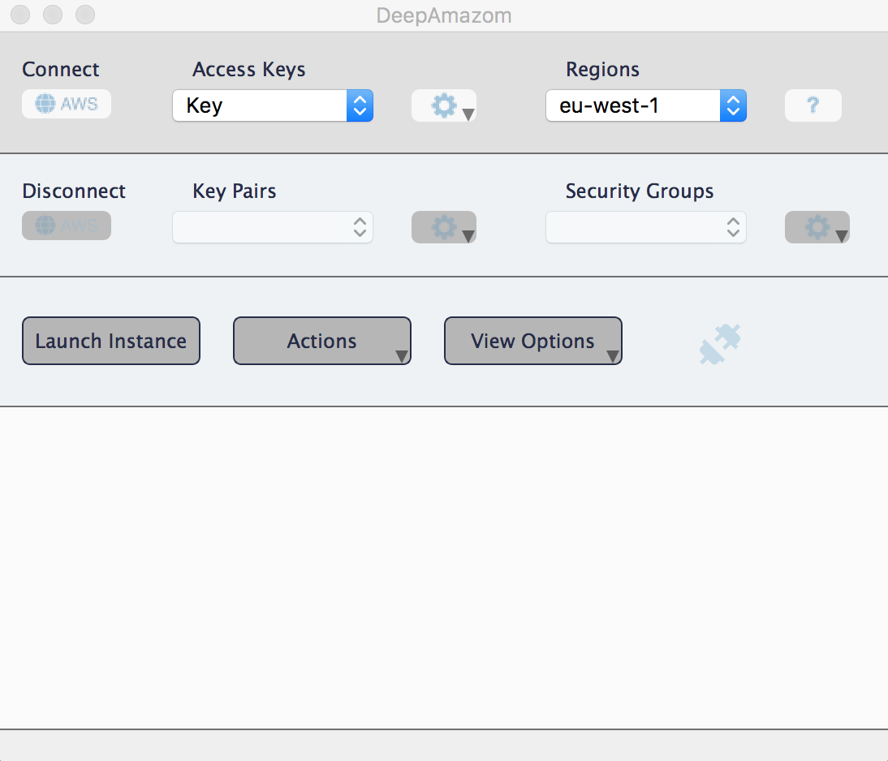
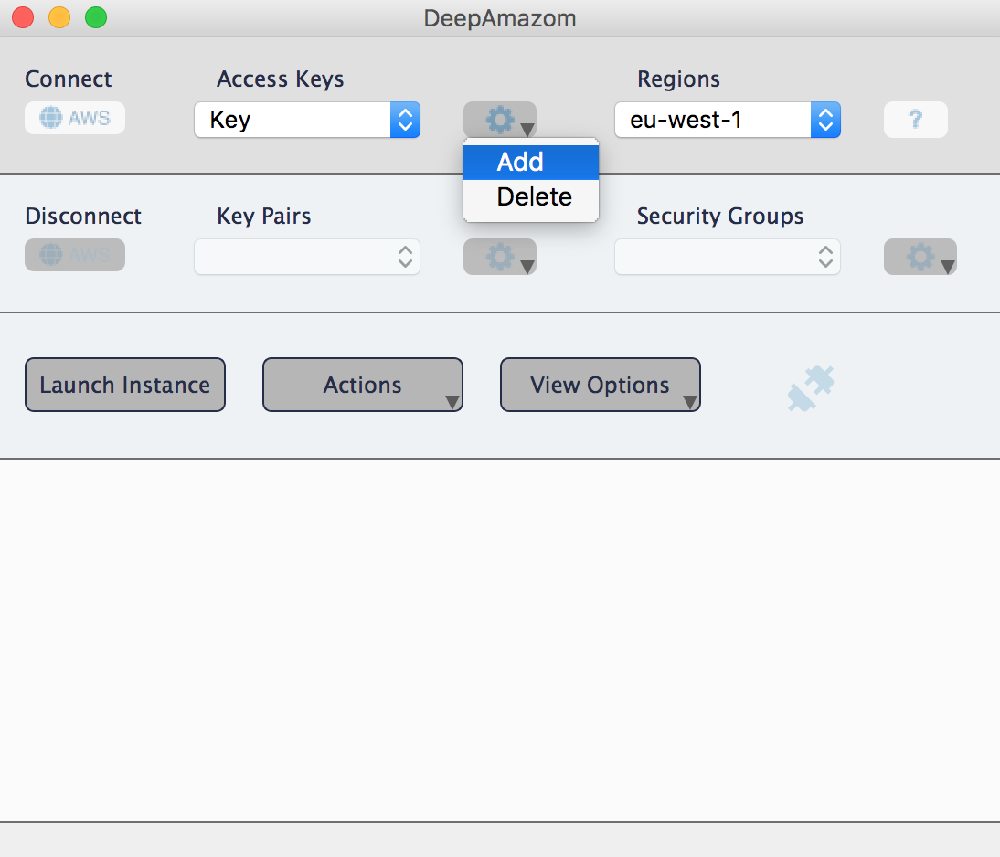
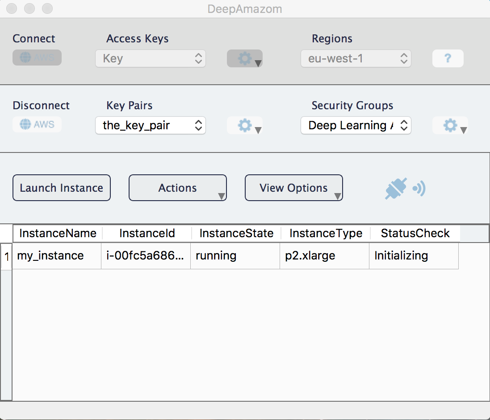
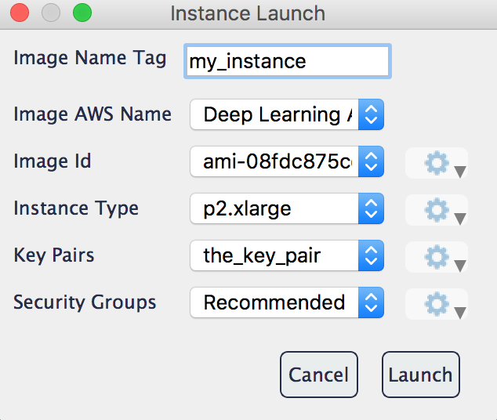
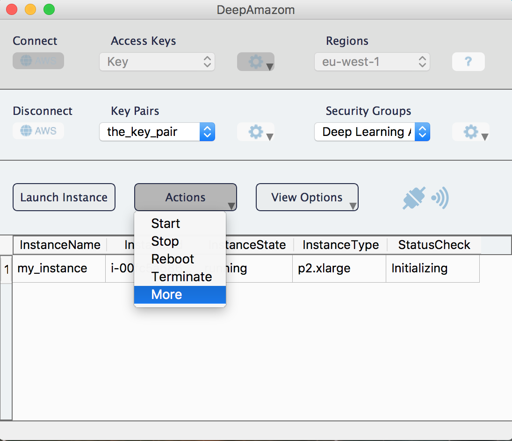

# DeepAmazon
A GUI I built with PyQt5 to easily start, stop, monitor etc. AWS EC2 instances.

Run the <code>main.py</code> file to get the followig interface.

  

You can provide your AWS credentials by clicking to a add a new key. Those are stored on a pickle file in the resources folder.

  

Once you have chosen a valid key and a region, you can connect to AWS by clicking <code>connect</code>. Once sussefully logged in you will be able to interact with the bottom of the window. If an instance is running this will also appear here. You will NOT be charged for simple being logged in, you are only charged for the EC2 instances you are running.

  

By clicking <code>Launch</code> the following window will open, which you can use to parametrise the EC2 instance you want to launch.

  

Finally, by clicking on Actions->More a new window opens with instructions on how to connect to the chosen instance through the terminal, or how to open a Jupyter Notebook connected with that instances. Both are features that I want to go into the GUI in the future.

  

